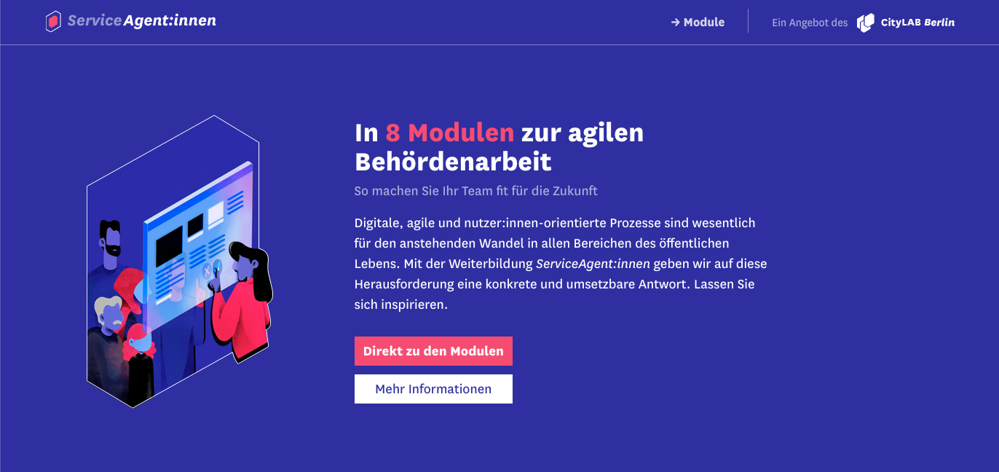

# ServiceAgent:innen



This repository contains the code of the ServiceAgent:innen (service agent) static website. It is a guide for contemporary and agile administration work. It presents 8 modules that illustrate how governmental administration can benefit from digital and user-centric processes, in order to modernize themselves and work more effectively.

## Tech Stack

### Content & Structure (HTML)
This static site is built with [Eleventy (11ty)](https://www.11ty.dev/docs/). It uses the templating language [liquid](https://liquidjs.com/index.html) to combine together data and templates.

### Styling (CSS)
The pages are styles using [Tailwind CSS](https://tailwindcss.com). 

### Interativity (JavaScript)
The Javascript included in this page is vanilla and is minified using [uglifyjs](https://www.npmjs.com/package/uglify-js).

## Getting started

Install dependencies:

```bash
npm install
```

Start development server:

```bash
npm run dev
```

A development server will be available at [http://localhost:8080](http://localhost:8080).

## Layouts

Layouts are templates that wrap other templates and surrounds them with markup. We use 3 types of layouts:

- **Base:** This layout contains the HTML present in every page. It includes, for instance, the HTML head and the meta tags, scripts and stylesheets.
- **Content:** This layout is applied to all the pages, except error pages such as the 404 page.
- **Module:** The layout applies to individual module pages and contains reccurrent elements such as the hero section or the module's methods.

## Home page

The homepage is `src/index.liquid`. It is a simple combination of other templates. Data for this page is defines in the `src/_data/` folder. 

## Modules

### Overview

The modules overview can be found in `src/modules/index.liquid`. It leverages the concept of collections in the liquid templating language. The file `src/modules/modules.json` defines how module pages are generated. For instance, it makes available all markdown files tagged `module` available under the collection named `module`. This can then be user in `src/modules/index.liquid` as such:

```html

  <li>
    {{ module.title }}
  </li>

```

### Individual module

The individual module pages are generated using the markdown files found in `src/modules/0{1-8}.md`. The  markdown's frontmatter and contents are used together with the layout `src/_includes/layouts/module.liquid` to create individual HTML pages.

<details>
<summary>The front matter is used as in this example</summary>

```yml
---
title: Service Design und Nutzerorientierung # required
socialMediaImagePath: /assets/images/modules/01-social-image.webp # required
socialMediaImageType: image/webp # required
socialMediaImageAlt: Modul 1 “Service Design und Nutzerorientierung” # required
abstract: Short summary of the module
example: Text for the example block of the page # required
example_image_alt: Description of what is depicted in the example image # required if example image is desired
methods: # array of methods, not required, often has only one entry
  - 
    title: Customer Journey
    abstract: Short summary of the method
    description: Detailed description'
    doc_path: /path/to/accompanying/doc.pdf
further_reading: # array of resources
  - 
    title: Bürokratieabbau durch Digitalisierung
    description: Gutachten Öffentliche IT und Fraunhofer
    link: https://www.normenkontrollrat.bund.de/resource/blob/300864/753834/ea4c588fa9edf79304d947baf766e624/2015-11-12-gutachten-egov-2015-dokumentation-data.pdf?download=1
  - 
    title: Zufriedenheit mit behördlichen Leistungen
    description: Befragung des Statistischen Bundesamts 2019
    link: https://www.amtlich-einfach.de/SharedDocs/Downloads/Ergebnisse_Buerger_2019.pdf?__blob=publicationFile&v=2
hypotheses: # array of short hypotheses, not required
  - 
    text: Service Design erzeugt gute Angebote, die Stress für Mitarbeiter:innen reduzieren, Geld sparen und Ressourcen freisetzen
```
</details>

## Assets

The assets such as images, icons, stylesheets, aso. can be found in `src/assets/`. If you want to use a folder inside that doesn't exist yet, you need to add it to the Eleventy [asset pipeline](https://www.11ty.dev/docs/copy/).

### Image optimizitaion

We try to serve images that are optimized for different devices and screen sizes. If you want to add a new image to the site, consider this workflow:

1. Create the image using you preferred software (e.g. Sketch)
2. Export the image in both PNG and WEBP format in the following widths: 400px, 600px, 800px (you may skip some of the widths if they are not needed for your use case). Create exports with the following structure: `{name}-{width}.{format}`, e.g. `hero-800.webp`
3. Your software might have not exported the images in the most compressed way. Double-check if further reduction of file size is possible.
4. In the site, use the partial in `src/_includes/partials/picture.liquid` to render the image. See the comments in the partial for usage instructions.
5. If the image will be rendered in such a way that the 800px-wide image does not suffize, consider adjusting the `picture.liquid` to the new requirements. For our _current_ state no image needs to be wider than 800px.

## Data

General data can be defined in `src_/data/`.

## Includes (Layouts and Partials)

`src/_includes` holds all [layouts](https://www.11ty.dev/docs/layouts/) and [partials](https://www.11ty.dev/docs/config/#directory-for-includes).

## Testing

For testing we use [Cypress](https://docs.cypress.io/guides/overview/why-cypress.html) and [Cypress Testing Library](https://testing-library.com/docs/cypress-testing-library/intro/).

Tests should cover the basic interactions of the website and ensure that all important content is present. Cypress tests should be added to `cypress/integration/` (currently there is only a test stub there).

## Running tests locally

Make a test run:

```bash
npm run test
```

Launching the test runner in watch mode:

```bash
npm run test:watch
```

## Running tests in CI

In `.github/workflows/test.yml` we have configured Cypress to run all pushes and pull requests to `main`. The passing of this test run is required for merging changes.

## Content Licencing

Texts and content available as [CC BY](https://creativecommons.org/licenses/by/3.0/de/). 

Illustrations by Lea Scheidt, all rights reserved.

## Credits

<table>
  <tr>
    <td>
      Made by <a src="https://citylab-berlin.org/de/start/">
        <br />
        <br />
        
      </a>
    </td>
    <td>
      A project by <a src="https://www.technologiestiftung-berlin.de/">
        <br />
        <br />
        
      </a>
    </td>
    <td>
      Supported by <a src="https://www.berlin.de/rbmskzl/">
        <br />
        <br />
        
      </a>
    </td>
  </tr>
</table>
